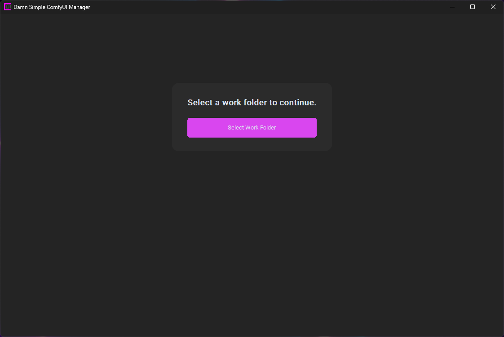
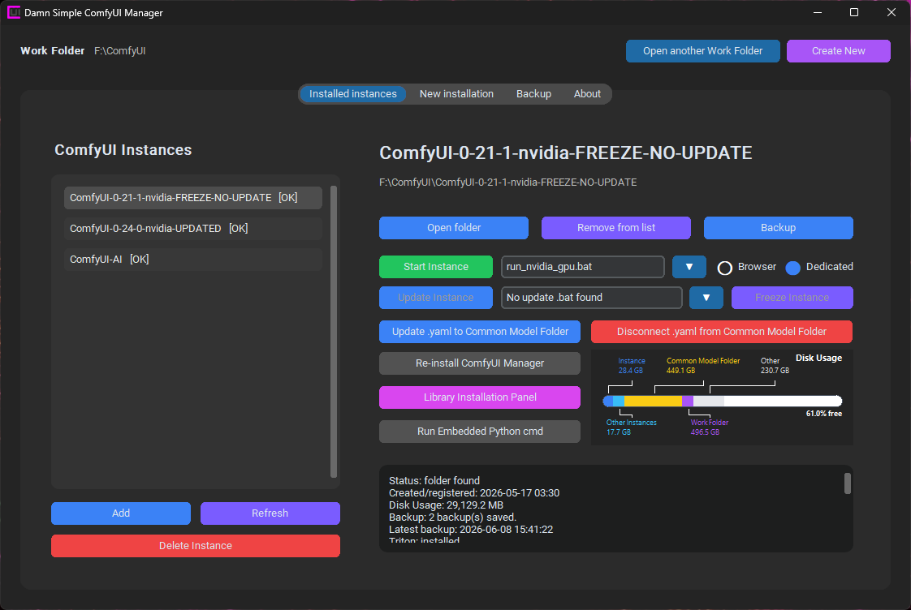
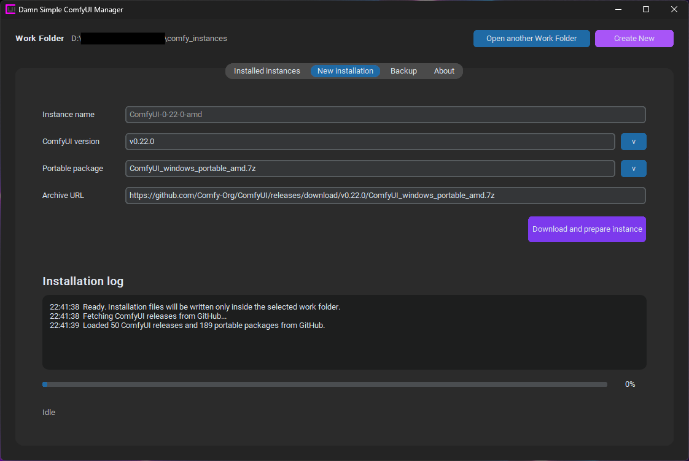
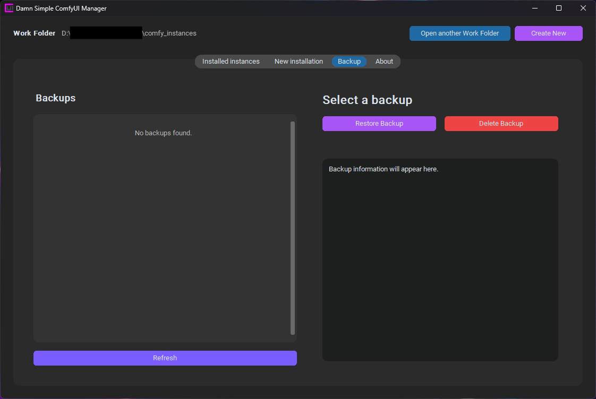

# Damn Simple ComfyUI Manager

Damn Simple ComfyUI Manager is a portable Windows application created through Vibe Coding to manage multiple local ComfyUI portable instances from a simple, contained interface.

It is designed for users who want to install, organize, launch, back up, freeze, and maintain different ComfyUI environments without manually jumping between folders, launchers, configuration files, and browser sessions.

The distributed application is intended to be a ready-to-use portable executable.

If you think it's appropriate, if you liked my idea, if it was useful to you, buy me a coffee! Thanks!

## Main Features

- Manage existing ComfyUI portable instances.
- Install new ComfyUI portable releases from GitHub.
- Choose the ComfyUI release version and portable hardware package.
- Keep each work folder independent with its own configuration.
- Start instances in Browser mode or Dedicated mode.
- Use a dedicated ComfyUI window with per-instance browser data.
- Create and restore targeted, customizable backups.
- Preserve backups even when an instance is deleted.
- Connect instances to a shared `common_models_folder`.
- Install optional components such as ComfyUI Manager, Triton, Ultralytics, Flash Attention, and Sage Attention.
- Download and use a local portable Git tool when needed for ComfyUI Manager installation.
- Freeze instances to prevent future updates.

## First Run

1. Put the portable executable inside its own folder.
2. Start the application from that folder.
3. On first launch, the app may create local files and subfolders next to the executable for its configuration, tools, and support data.
4. Select or create a Work Folder.
5. The app creates local configuration and support folders inside that Work Folder.
6. The main interface becomes available after the Work Folder is selected.

Each Work Folder has its own instances, settings, backups, browser cache, and shared model folder. This makes it possible to keep different ComfyUI environments separated from each other.

## Installed Instances

The Installed Instances section lets you manage ComfyUI instances already present in the selected Work Folder.

Available actions include:

- Open the instance folder.
- Remove the instance from the list.
- Create a backup.
- Start the instance.
- Update the instance.
- Freeze the instance.
- Install or reinstall ComfyUI Manager.
- Connect or disconnect `extra_model_paths.yaml` from the common model folder.
- Open the Library Installation Panel to install or re-install local instance libraries such as Triton, Ultralytics, Flash Attention, and Sage Attention.
- Open an embedded Python command prompt for custom instance-level commands.
- View a graphical disk usage summary for the selected instance, other instances, the Work Folder, and the shared common model folder when connected.
- Delete the instance from disk while keeping its backups and removing its dedicated browser cache.

When ComfyUI Manager installation needs Git, the app can download and use a local portable Git tool inside its own `_tools` folder instead of requiring Git to be installed globally on Windows.

The Library Installation Panel is tied to the selected instance. If a supported library is already present, its button changes to `Re-install` so it can be refreshed inside that same instance.

For binary-sensitive libraries such as Sage Attention and Flash Attention, the app detects the selected instance Python, Torch, CUDA, and Windows platform tags, then installs only an exact matching `.whl` wheel. Compatible wheels are resolved from known Windows AI wheel catalogs such as Wildminder AI-windows-whl and Comfy-Org wheels. If no exact compatible wheel is found, nothing is installed.

Wheel-based library installs are performed from the downloaded local wheel only, without dependency resolution, so the app does not replace the instance Torch/CUDA environment while installing Flash Attention, Sage Attention, or similar binary-sensitive libraries.

## Start Modes

`Browser` mode starts the selected instance normally through its `.bat` launcher. ComfyUI behaves as it usually does and can open in the system browser according to the selected launcher behavior.

`Dedicated` mode starts the selected instance and opens ComfyUI in a dedicated application window. This window is meant to be a clean ComfyUI-only environment, without address bars or extra browser controls.

The dedicated window stores browser data separately for each instance. This helps keep cookies, cache, and session data independent between different ComfyUI installations.

### Dedicated Window Commands

The dedicated window includes two small hidden commands:

- `Refresh`
- `Clean Cache`

To show them, move the mouse pointer to the top-left corner of the dedicated window. The commands appear for a few seconds and then hide automatically.

Use `Refresh` when the ComfyUI interface needs to be reloaded.

Use `Clean Cache` when custom node interfaces, JavaScript panels, or UI elements are not loading correctly. This clears the dedicated cache for that specific instance and reloads the page.

Both commands ask for confirmation before running.

## New Installation

The New Installation section downloads ComfyUI portable packages from GitHub.

1. Choose a ComfyUI version.
2. Choose a portable package.
3. Set an Instance Name or use the generated name.
4. Start the download and preparation process.

The app installs ComfyUI into a subfolder of the selected Work Folder. It does not install directly into the Work Folder root.

While an installation is running, the visible interface controls are temporarily disabled to avoid accidental changes. A red `Cancel installation` button appears during the process and can be used to stop the current installation after confirmation. When cancelled, the app removes partial download and extraction files for that instance.

## Backup

The Backup section lists backups stored inside the selected Work Folder.

Backups are compressed files containing selected instance data only. The available backup items are selectable, so each backup can be customized depending on what you want to preserve:

- `workflows`
- `subgraphs`
- `custom_nodes`
- `extra_model_paths.yaml`

A backup can include all of these items or only some of them.

Backups can be restored to the original instance or to another compatible instance. This is useful when moving settings, workflows, or custom nodes from one ComfyUI installation to another.

Restore operations ask for confirmation before overwriting files.

## Common Model Folder

Each Work Folder can contain a `common_models_folder` used to share model paths across multiple instances.

The app can update an instance `extra_model_paths.yaml` so ComfyUI reads models from the common folder. It can also disconnect the instance by renaming the active YAML back to `.example`.

This allows several ComfyUI instances to use a shared model library without duplicating large model files inside every installation.

## Notes

Damn Simple ComfyUI Manager is focused on local portable use. It is meant to keep ComfyUI instance management practical, compact, and easy to understand while still allowing separate work folders, separate instance settings, and dedicated per-instance browser sessions.

## License

Damn Simple ComfyUI Manager is released under the GNU General Public License v3.0.

Copyright (c) 2026 maddok.
